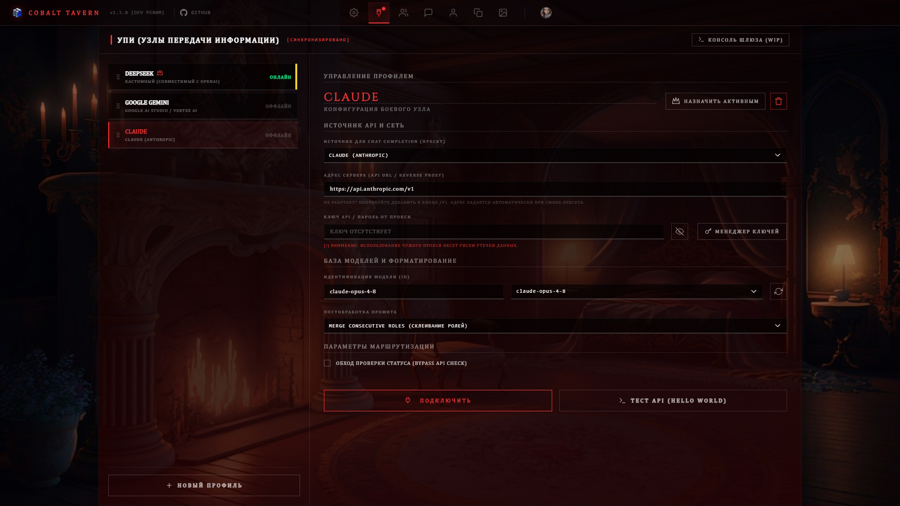
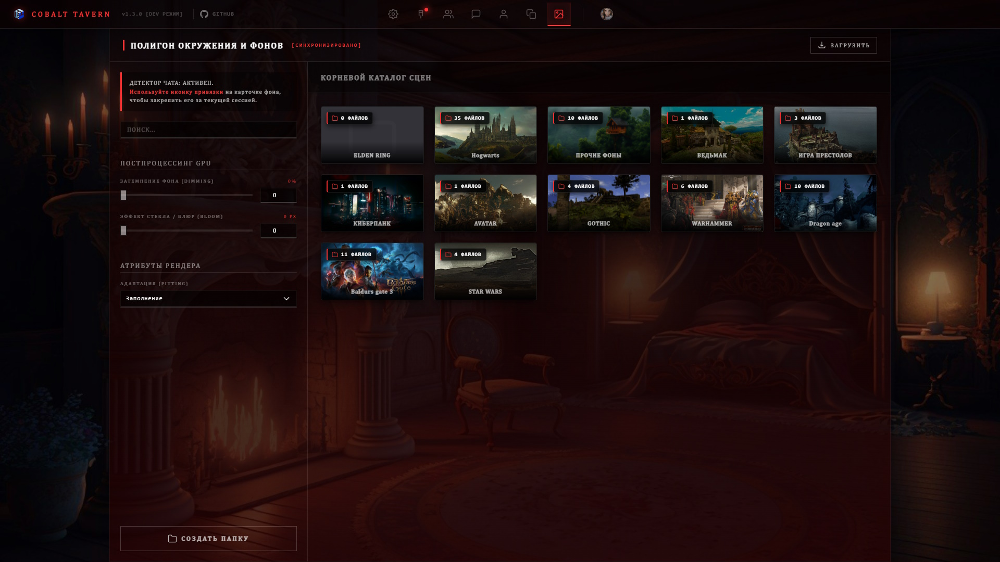

<div align="right">
  <a href="README.ru.md">🇷🇺 Русский</a> | <strong>🇬🇧 English</strong>
</div>

<a name="readme-top"></a>

<div align="center">

#  Cobalt Tavern (Core Engine)

<p align="center">
  
</p>

[](https://github.com/GrishaDeLumiere/Cobalt-Tavern/stargazers)
[](https://nodejs.org/)
[](https://www.solidjs.com/)
[](LICENSE)

---
### 🌟 ROADMAP & COMMUNITY GOALS 🌟
The project is under active development. Drop a ⭐️ to support upcoming feature releases and ecosystem milestones!

* [ ] **100 Stars** 🔓 — **UNLOCKED DIRECTORY.** Full core source code release (SolidJS Frontend + Fastify Backend) in this repository for personal study (Shared Source).
* [ ] **200 Stars** 🔌 — **MODDING API INIT.** Plugin system development rollout. Launch of official documentation for writing custom extensions and hooks without breaking core functionality.
* [ ] **??? Stars** 🚀 — *Classified milestone...*
---

</div>

**Cobalt Tavern** is an ultimate, uncompromising local interface designed for LLM power users, roleplayers, and enthusiasts.
Engineered as a faster, strictly deterministic, and fully controllable alternative to existing frontends. No unpredictable model behavior: you control every single byte injected into the neural network context.

## 📸 Interface Preview

<p align="center">
  
  &nbsp;
  
   &nbsp;
  
   &nbsp;
  
    &nbsp;
  
    &nbsp;
  
</p>

## 🚀 Core Features

* **🏗 Total Prompt Control (Prompt Builder):** A unique context assembly pipeline. Create custom Nodes, assign roles (System / User / Assistant), set exact injection depths and priorities. The core calculates token allocations in real time.
* **🔬 Deep Emulation (Visualizer):** Built-in context compilation inspector. Inspect the exact hierarchy, order, and depth at which system prompts, lorebook entries, and history turns merge before being dispatched to the model.
* **🧠 Advanced Lore Engine:** Intelligent lorebook scanner supporting boolean logic gates (`AND ALL`, `AND ANY`, `NOT ALL`, `NOT ANY`), recursion limits, and customizable global/local scanning strategies.
* **🛡 Three-Layer Regex Filtering:** High-performance regex pipeline operating across three distinct stages:
  * `INCOMING` — Intercepts and sanitizes AI outputs before persistent storage.
  * `OUTGOING` — Strips internal instructions or formatting tokens from the prompt sent to the LLM.
  * `DISPLAY` — Client-side cosmetic rendering replacements without altering stored logs.
* **👨‍⚕️ Surgical Chat Manager:** Robust Drag-&-Drop interface designed to handle thousands of sessions. Bind chats to characters, rename logs, export dumps to `.jsonl`, and filter by tags/franchises in seconds.
* **📖 Persona Manager:** Maintain an unlimited roster of user personas for varied roleplay sessions, each with dedicated context injections. Switch profiles instantly with a double-click.
* **Smart UI Parser:** Native support for thought streaming (`<think>` tags) with real-time generation speed metrics (tokens/sec), automated log formatting, rich Markdown, and syntax-highlighted code blocks.
* **Ultra-Fast Rendering:** Built on SolidJS for near-instant DOM updates and rock-solid 60 FPS performance, even with chat histories exceeding 5,000+ messages.
* **⚙️ Cobalt Syntax Engine:** Proprietary high-throughput procedural prompt generation engine. Builds Abstract/Concrete Syntax Trees (CST) on the fly, supports conditional logic branches (`IF`/`ELSE`), environment variable interpolation, and deep context overrides. Fully optimized for zero-overhead backend processing.

## 💻 System Requirements

* **OS:** Windows 10/11, Linux, macOS
* **Runtime:** Node.js v18 or higher
* **Hardware:** Minimal CPU/RAM footprint. Compute load depends entirely on your backend inference server (KoboldCpp, LM Studio, Oobabooga, etc.).

## 🛠 Installation & Quick Start

1. Download the latest release archive or clone the repository:
   ```bash
   git clone https://github.com/GrishaDeLumiere/Cobalt-Tavern.git
   ```
2. Navigate to the project directory.
3. Run `start.bat` (on Windows) or launch via Node.
4. The bootstrap loader handles everything automatically: installs missing dependencies, spawns the REST API gateway on port `8000`, and opens the UI in your default browser.

## 📫 Feedback & Issue Tracking

<p align="center">
  <a href="https://github.com/GrishaDeLumiere">
    
  </a>
</p>

* Encountered a bug, have an architectural proposal, or want to suggest a feature? [Open an Issue on GitHub](https://github.com/GrishaDeLumiere/Cobalt-Tavern/issues).

## 📜 License (Proprietary: Personal Use Only)

This software is distributed under a **strict proprietary license** (Copyright (c) 2026 GrishaDeLumiere) and is designated for **PERSONAL USE ONLY**.

**Strictly prohibited:**
* Re-distributing, claiming ownership, or hosting public distribution forks.
* Extracting and integrating the core codebase into third-party interfaces.
* Commercial distribution or monetization in any form.

Any public mention or review must include a direct link to this official repository. For comprehensive legal terms, refer to the `LICENSE` file.

---

<p align="center">
  <sub>Engineered with 💜 by <b>GrishaDeLumiere</b></sub>
</p>