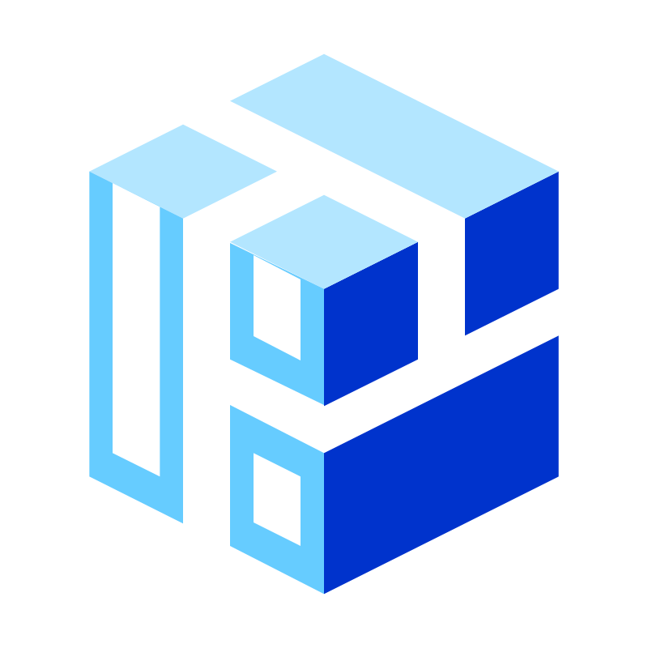
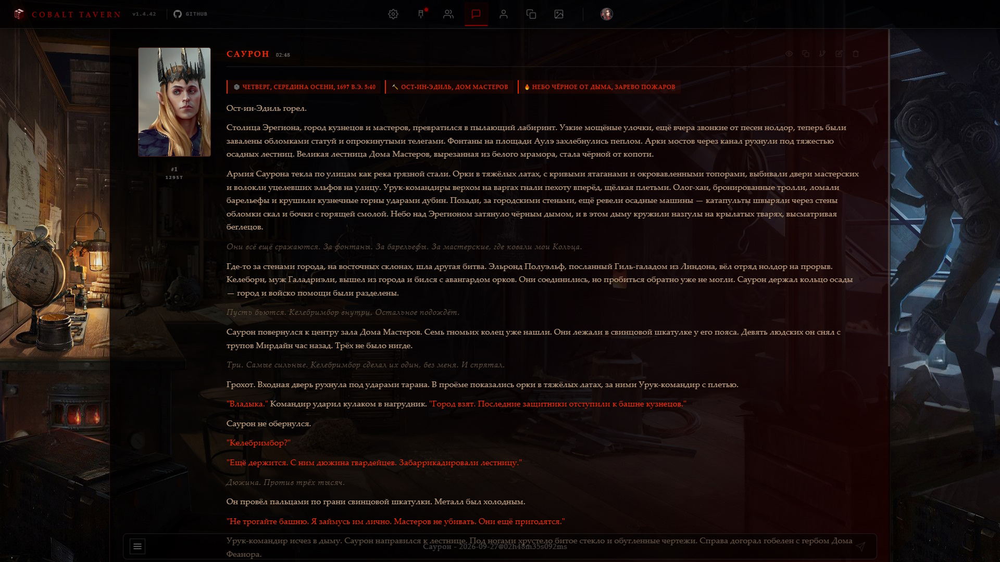
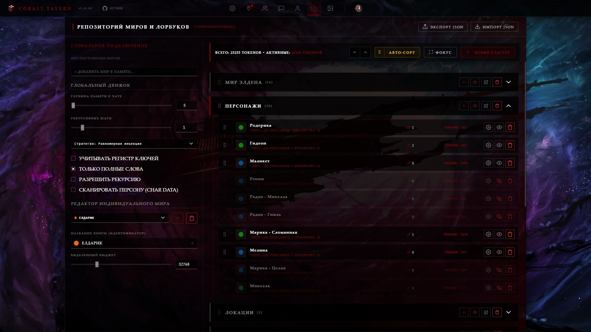
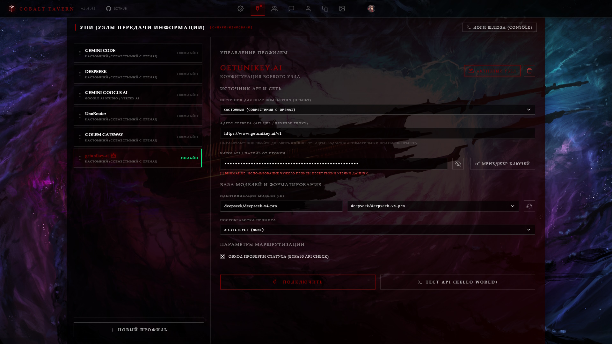
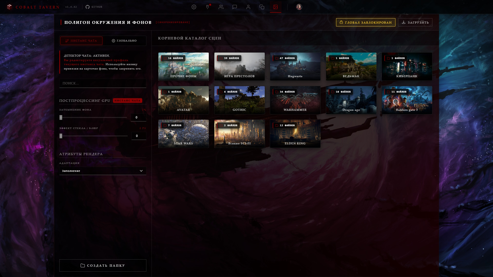
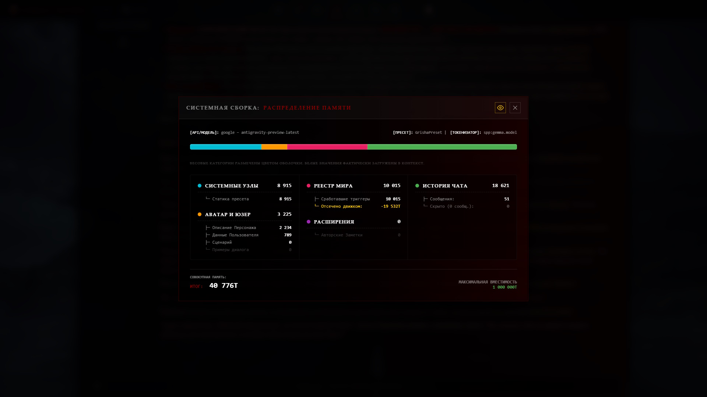
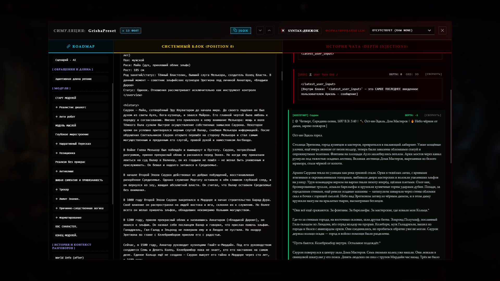

<div align="right">
  <a href="README.md">🇷🇺 Русский</a> | <strong>🇬🇧 English</strong>
</div>

<a name="readme-top"></a>

<div align="center">

#  Cobalt Tavern

<p align="center">
  
</p>

### Autonomous Workstation, Deterministic LLM Inference Engine & Operating Environment for Text Roleplay

<p align="center">
  <a href="#-core-architectural-modules">Features</a> •
  <a href="#-architecture-comparison">Comparison</a> •
  <a href="#-interactive-prompt-matrix-prompt-simulator">Prompt Simulator</a> •
  <a href="#-installation--launch">Installation</a> •
  <a href="#-roadmap--milestones">Roadmap</a>
</p>

<!-- BADGES IN COBALT SIGNATURE PALETTE -->
[](https://fastify.dev/)
[](https://nodejs.org/)
[](https://www.solidjs.com/)
[](#)
[](https://webassembly.org/)
[](LICENSE)

---

</div>

> [!NOTE]
> **Cobalt Tavern** is an uncompromising alternative to bloated, legacy web interfaces. Engineered from the ground up as a **high-speed, deterministic, and surgical workstation**: zero-delay context compilation, byte-level prompt X-ray auditing, non-destructive dialogue compression, and steady high framerates even across sessions spanning thousands of messages.

---

### 🌟 ROADMAP & MILESTONES

<div align="center">

| Goal | Status | Milestone Description |
| :---: | :---: | :--- |
| **⭐ 100 Stars** | 🔓 *In Progress* | **UNLOCKED REPO.** Full source code release of the ecosystem (SolidJS UI + Fastify Backend) to the public. |
| **⭐ 200 Stars** | 🔌 *Locked* | **MODDING API & SDK.** Release of plugin architecture, inference lifecycle hooks, and third-party extension SDK. |
| **⭐ 500 Stars** | 🚀 *Classified* | Deployment of the decentralized tactical arena and combat hub... |

</div>

---

## 📸 Interface Gallery

<p align="center">
  
  &nbsp;
  
</p>
<p align="center">
  
  &nbsp;
  
</p>
<p align="center">
  
  &nbsp;
  
</p>
<p align="center">
  
  &nbsp;
  
</p>

---

## ⚡ Architecture Comparison

| Capability | Legacy Web UIs | 💠 Cobalt Tavern |
| :--- | :---: | :---: |
| **Idle RAM Footprint** | 450 – 850 MB (V8 Bloat) | **< 100 MB** (High-Efficiency Node Engine) |
| **Prompt Assembly Audit** | Blind payload dispatch / text logs | **Interactive 3-Column Matrix (X-Ray Inspector)** |
| **Context Window Control** | Raw token counters | **Spectral HUD with Lore Budget Trim Visualizer** |
| **Context Compression (Summary)** | Destructive (permanently deletes messages) | **Zero Data Loss (`summary_group` virtual projection)** |
| **Depth Injections** | Rigid positional offsets | **Multi-role depth injection with strict `order` sorting** |
| **Macro/Syntax Processor** | Regex replacement / unsafe eval | **Strict AST/CST Compiler (Chevrotain parser)** |
| **Reactive Frontend** | Heavy Virtual DOM / jQuery bloat | **Zero-Cost Fine-Grained Reactivity (SolidJS)** |

---

## 🚀 Core Architectural Modules

### 1. 📊 Context Memory HUD
An interactive diagnostic monitor providing granular real-time audits of the active context window:
* **Categorical Spectral Visualizer:** Clear payload distribution segmented into five discrete memory layers:
  * 🔵 **System Nodes:** Static preset prompts, behavior directives, and generation formatting rules.
  * 🟠 **Avatar & User:** Character definitions (description, scenario, dialogue examples) and active persona modules.
  * 🔴 **World Lore (Lorebooks):** Active knowledge base entries, complete with budget cutoff telemetry: **"Trimmed by Engine"** (highlights the exact token volume safely pruned by the book's allocation cap).
  * 🟣 **Extensions:** Author's notes and dynamic pipeline injections.
  * 🟢 **Dialogue History:** Active chat turn payload with full tracking of hidden and collapsed messages.
* **Native WASM Tokenization Alignment:** Real-time token calculation driven by native WASM runtimes (`spp:gemma.model`, `tiktoken`, `web-tokenizers`), projecting utilization against model limits up to 1,000,000+ tokens.

> [!TIP]
> **One-Click Live Simulation ("The Eye"):** Click the eye icon directly within the Memory HUD during an active chat. The terminal instantly launches the Prompt Matrix, deconstructing your current session into atomic nodes in real time.

---

### 2. 🔬 Interactive Prompt Matrix (Prompt Simulator)
A visual prompt construction inspector accessible both from preset editors and **directly inside any live dialogue session**:
* **Dual-Entry Architecture:**
  * *From the Preset Builder:* For template authoring, syntax verification, and assembly rule debugging.
  * *From Active Chat:* For instant X-ray decomposition of ongoing roleplay, showing exact lore activations, variable states, and depth injections.
* **Three-Column Prompt Projection:**
  * **Roadmap (Left):** Hierarchical assembly tree (`[START]`, `[CHARACTER]`, `[DIRECTIVES & LENGTH]`, system instructions).
  * **System Block / Position 0 (Center):** Linear breakdown of directives, scenario anchors, and environment tags in strict execution order (`ORD: 100`).
  * **Chat History & Depth Injections (Right):** Real-time visualization of dynamic injections (lorebook entries set to "Depth", Author's Notes, and custom preset nodes) spliced DIRECTLY BETWEEN dialogue turns at target depths (`DEPTH: 3`, `DEPTH: 2`, `DEPTH: 1`), respecting assigned roles (`System` / `User` / `Assistant`) and priority values (`order`).
* **Syntax Engine Live Toggle:** Instant switching between raw macro syntax `{{if}}...{{/if}}` and fully compiled runtime output.

---

### 3. 📌 Pulsed Author's Notes Engine
An isolated directive injection subsystem (`author_notes.json`):
* **Pulsed Firing Intervals (`interval`):** Instead of injecting on every turn (which triggers model banding and context dilution), notes can trigger periodically every $N$ user messages (`userMsgsCount % interval === 0`), gently steering narrative arcs.
* **Three Placement Planes:**
  * `before` — Injected at the head of the system block with top priority (`order: -9999`).
  * `after` — Injected at the tail of the system block right before dialogue history (`order: 9999`).
  * `depth` — Surgically spliced into chat history at precise depth indices.
* **Role Masking:** Full flexibility to designate the injected node's protocol role as `system`, `user`, or `assistant`.

---

### 4. 📝 Narrative Summarization with Zero Data Loss (`summary_group`)

> [!IMPORTANT]
> **Zero Data Loss Guarantee:** Unlike conventional implementations, context compression in Cobalt Tavern **never removes messages from chat storage files**. All original turns, emotional RP beats, thoughts, and attachments remain permanently preserved on disk and visible in the chat interface.

* **Dynamic In-Flight Compression:** Grouping metadata marks a cluster of messages with a shared `summary_group.id`. During prompt compilation (`buildPrompt`), the engine dynamically collapses the entire cluster into **a single narrative summary node** (`isSummaryNode: true`). The model receives a compact synopsis, reclaiming thousands of tokens, while the player retains the full, unmodified conversation history.
* **Group Leadership (`isLast`):** The consolidated summary text is anchored to the leading node of the group, preserving narrative continuity and configurable output roles (`user`, `assistant`, `system`).
* **Reasoning Artifact Cleansing:** Prior to generating summaries, the pipeline scrubs foreign reasoning tags (`<think>`, `<thought>`, `<details>`), ensuring the model summarizes factual events and character interactions rather than internal model artifacts.

---

### 5. 🧠 Advanced Lore Engine (Knowledge Base & Simulator)
* **Cluster Hierarchy:** Organization of lore entries into collapsible clusters and sub-categories.
* **Dual-Tier Semantic Matching:**
  * **Primary Keys:** Core activation keys with UTF-8 boundary awareness, exact matching (`exactMatch`), and case sensitivity options (`caseSensitive`).
  * **Secondary Logic:** Secondary condition filtering with 4 operational modes:
    * `AND ANY` (0) — Fires if any secondary key is detected.
    * `AND ALL` (3) — Requires all secondary keys to be present.
    * `NOT ANY` (2) — Strict exclusion: aborts if even one secondary key matches.
    * `NOT ALL` (1) — Aborts only if every secondary key matches simultaneously.
* **Recursive Scanning:** Evaluates the content of activated lore entries for secondary keyword triggers, guarded by cycle-prevention flags (`delayUntilRecursion`, `preventRecursion`, `excludeRecursion`).
* **Budgeting & Priority Balancing:** Strict per-book token allocations (`budget`), `ignoreBudget` overrides, and sorting strategies (`even`, `char_first`, `global_first`).
* **Arbitrary Depth Splicing:** Lore entries can inject not only at top/bottom positions but directly into chat history with **role remapping** (`System`, `User`, `Assistant`) and priority ordering.
* **Live Lore Simulator (`/api/lorebooks/simulate`):** Test trigger logic, budgets, and recursion in real time without dispatching remote inference requests.

---

### 6. 💬 Chat Operating System (Storage Management & Dialogue Surgery)
A high-throughput filesystem suite designed for massive roleplay archives:
* **Context Branching:** Instantly fork parallel timelines (`ВЕТВЬ_`) from any arbitrary dialogue turn to explore alternative narrative branches.
* **Surgical Live Patching (`/api/chats/meta`):**
  * Retroactively rename characters or users across thousands of log entries in milliseconds.
  * Data Sanitization: Token count migration (moving root `tokens` to `extra.token_count`), orphaned metadata cleanup, and invalid avatar reference pruning.
  * Automated filesystem relocation when re-binding a chat's `character_id`.
* **Batch Operations:** Mass deletion and **bulk import of ST JSONL dumps**, automatically organizing files into designated character storage trees.
* **O(1) Differential Caching:** Memory-resident index with `mtime` cache invalidation for near-instant chat list lookups.

---

### 7. 🎨 Interface Customization & Chat Typography

<details>
<summary><b>Expand built-in themes and typography options</b></summary>
<br>

* **17 Built-In Designer Themes:**
  * *Cobalt Core*, *Cyberpunk 2077 (Night City)*, *Warhammer 40k (Darktide)*, *Rogue Trader*.
  * *True Grimdark*, *Dark Side (Sith)*, *Faerûn (BG3)*, *Winter is Coming (GoT)*.
  * *Blood Mage (Dragon Age)*, *Slytherin*, *Stark HUD (Marvel)*, *Kuromi Kawaii*, and more.
* **Granular Typography & Palette Calibration:** Independent color channels for narrative prose, dialogue quotes, bold emphasis, and dedicated slots for:
  * Model thoughts and reasoning traces (`thoughtColor` and `thoughtAltColor`).
  * Sound effects and atmospheric cues (`soundColor`).
  * Whispers and hidden transmissions (`whisperColor`).
* **Atmospheric & Optical Controls:** Custom backdrop dimming (`bgDim`), bloom diffusion (`bgBloom`), panel translucency, multi-angle gradients, and workspace width constraints (900px to 1600px, or `Full Width`).
* **Custom Font Subsystem:** Upload local font files (`.ttf`, `.otf`, `.woff`, `.woff2`) with real-time UI application across all typography elements.
* **Hierarchical Background Catalog:** Nested location folders with color tagging and drag-and-drop ordering.

</details>

---

### 8. ⚙️ Cobalt Syntax Engine (AST/CST Macro Compiler)
Server-side abstract syntax tree compiler built on top of **Chevrotain**:
* **Variable Operations:**
  * Session-local variables: `{{.hp = 100}}`, `{{.hp--}}`, `{{.mana += 25}}`.
  * Global profile state: `{{$reputation = 50}}`, `{{$gold ??= 10}}`.
  * Logical evaluations: `{{.status == 'alive'}}`, `{{$rank >= 5}}`.
* **Conditional Branching (IF / ELSE):**
  ```text
  {{if .isStealth}}
      You slip silently through the shadows...
  {{else}}
      Your heavy armor clatters against the stone floor!
  {{/if}}
  ```
  Full support for condition inversion (`!`), deferred evaluation (`delayArgResolution`), and whitespace preservation flags (`#`).
* **Deterministic Entropy:**
  * `{{pick::Dagger::Sword::Axe}}` — Deterministic selection seeded by node position and conversation MD5 hash.
  * `{{roll::2d6+3}}` — Tabletop dice engine powered by `droll`.
  * `{{random::Option A::Option B}}` — True entropy-based randomizer.

---

### 9. 🌐 Unified Inference Gateway
* **Supported Protocols:** OpenAI, OpenRouter, Groq, Anthropic Claude, Google Gemini / Vertex.
* **Next-Gen Google Interactions API:**
  * Native orchestration for reasoning agents (`deep-research`, `antigravity`, `gemini-3`).
  * Granular reasoning budget tuning (`thinking_budget` / `thinking_level`).
  * Native thought trace extraction and segregated streaming (`step.start`, `step.delta`, `<think>` tags).
* **Fault-Tolerant Abort Pipeline:** Immediate outbound connection termination via `AbortController` whenever generation is stopped by the user.
* **Circular Request Inspector:** Ring buffer holding the last 15 complete transactions (raw request payloads, responses, latency, and HTTP statuses).
* **Context Sanitization Policies:** `none`, `semi_strict`, and `strict` modes (role consolidation, consecutive duplicate merge, and assistant padding).

---

### 10. 🧮 Native WASM Tokenization
* **SentencePiece WASM:** Local parsing for binary tokenizer models (`.model`) covering Llama, Mistral, and Gemma architectures.
* **Web-Tokenizers & Tiktoken:** Native BPE tokenizer bindings for Claude and OpenAI GPT families.
* **OOM Guarding:** 25,000-character chunking mechanism preventing V8 heap exhaustion on massive inputs.

---

### 11. 👤 Modular Persona & Character Architecture
* **Modular Player Personas:** Build user profiles using independent, toggleable modules (appearance, inventory, backstory, passive attributes) structured in custom categories.
* **Decentralized Records:** Each character and persona is isolated within individual `.json` entities inside `data/default-user/`.
* **Streaming Media Pipeline:** Fastify multi-part uploads with built-in streaming directly to disk, capped at 250 MB.

---

## 💻 System Requirements

* **Operating System:** Windows 10/11, Linux (Ubuntu, Debian, Arch), macOS (Intel / Apple Silicon).
* **Runtime:** Node.js v18.0.0 or higher.
* **Resource Usage:** Core server consumes less than 100 MB of RAM at idle. Processing footprint depends entirely on your chosen inference backend (KoboldCpp, LM Studio, vLLM, Ollama, or Cloud APIs).

---

## 🛠 Installation & Launch

### Automated Launch (Windows)
```bash
# 1. Clone the repository
git clone https://github.com/GrishaDeLumiere/Cobalt-Tavern.git

# 2. Run the initialization script
start.bat
```
*The script initializes the environment, audits dependencies, builds the filesystem hierarchy, and opens the terminal in your default browser.*

### Manual Launch (Linux / macOS / Developer Mode)
```bash
# 1. Navigate to the core directory and install dependencies
cd core
npm install

# 2. Start the server
npm start

# Or in development mode with hot-reload forwarding:
npm run dev
```

---

## ⚙️ Server Configuration (`core/config.json`)

<details>
<summary><b>Expand config.json schema</b></summary>
<br>

On initial startup, the engine creates a standard `config.json` file:

```json
{
    "port": 8000,
    "host": "0.0.0.0",
    "autoOpenBrowser": true
}
```

| Parameter | Default | Description |
| :--- | :---: | :--- |
| `port` | `8000` | Fastify REST API and UI static delivery port. Overridden by environment variable `PORT` if set. |
| `host` | `0.0.0.0` | Network binding interface (`0.0.0.0` exposes to local network; `127.0.0.1` binds to localhost only). |
| `autoOpenBrowser` | `true` | Automatically launches system default browser once the server binds successfully. |

</details>

---

## 🔄 Core Updater Subsystem

The server includes a streaming release synchronization module (`/api/updater`):
* Version parity checking against remote `package.json` specifications via GitHub API.
* Real-time update progress streamed over Server-Sent Events (`/api/updater/update-stream`).
* File-by-file delta sync verified via **SHA-256** checksum hashes (`getFileHash`).
* **User Data Protection:** User-generated directories and files (`data/`, `.env`, `node_modules`, `.git`) are strictly isolated via `IGNORE_LIST` and are never overwritten during updates.
* Automated extraction and cleanup of staging archives inside `temp_update/`.

---

## 📈 Project Growth

<div align="center">

[](https://star-history.com/#GrishaDeLumiere/Cobalt-Tavern&Date)

</div>

---

## 📜 License (Proprietary: Personal Use Only)

This software is distributed under a proprietary license: **Copyright (c) 2026 GrishaDeLumiere**.

* Granted strictly for personal, non-commercial use.
* Forking for public re-distribution, packaging, or re-branding is strictly prohibited.
* Commercial extraction or integration of engine components into cloud services is strictly forbidden.

Refer to the full terms in the [LICENSE](LICENSE) file.

---

<div align="center">
  <sub>Architectural Design & Core Engineering by <b>GrishaDeLumiere</b></sub>
</div>