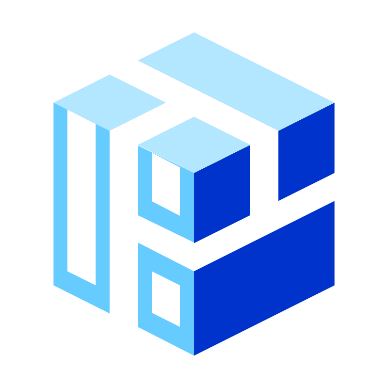
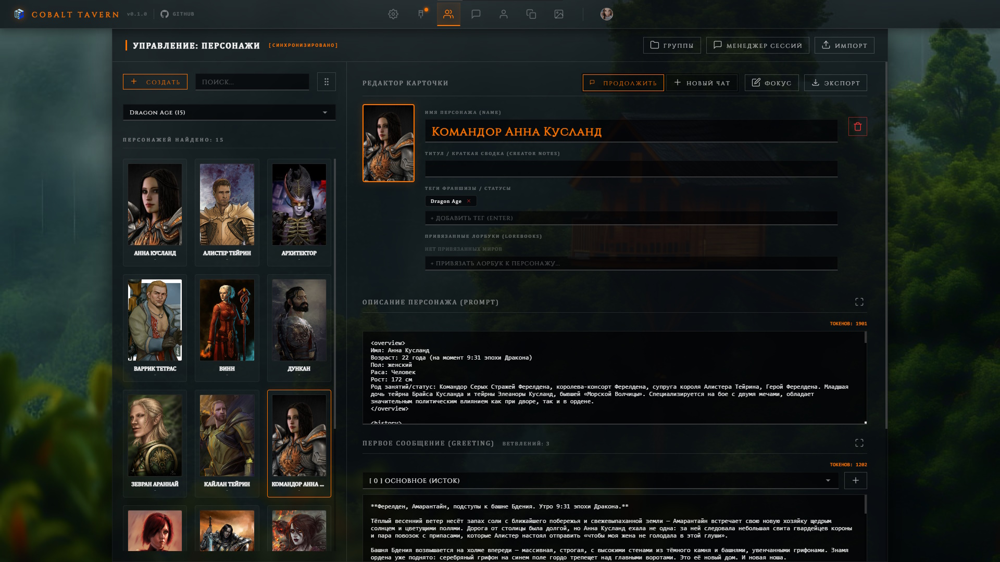
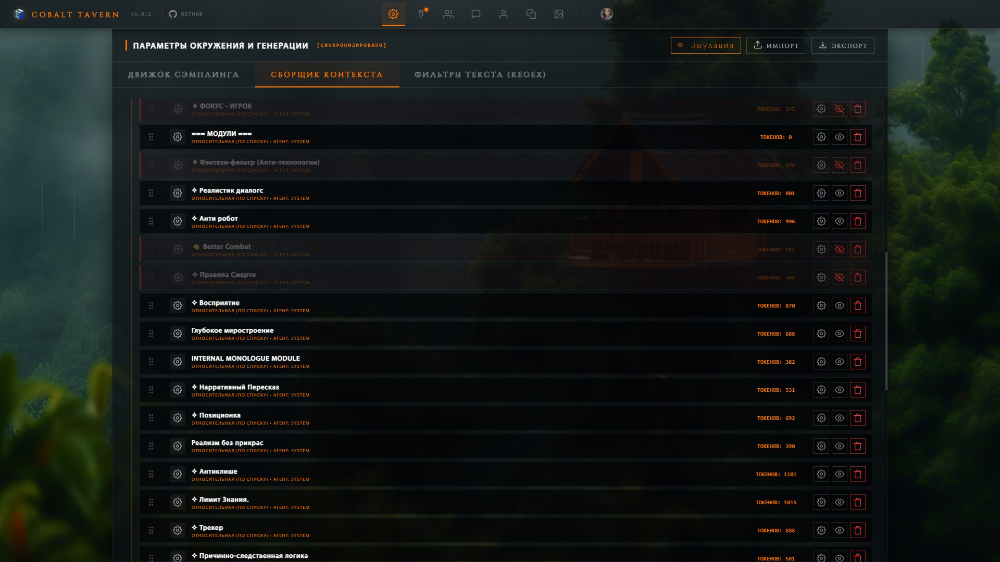
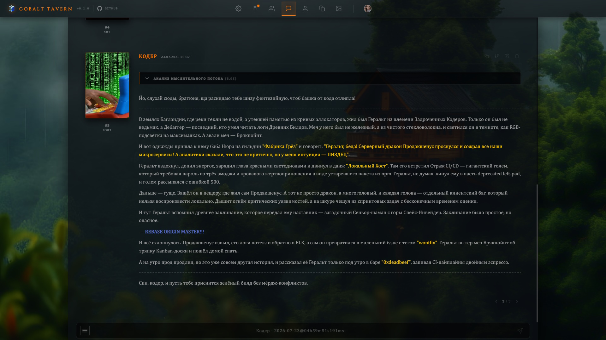
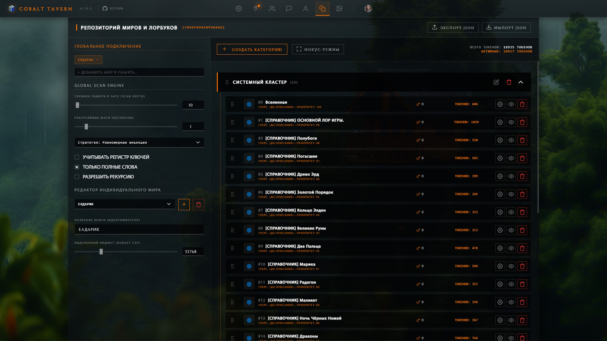

<a name="readme-top"></a>

<div align="center">

#  Cobalt Tavern (Core Engine)

<p align="center">
  
</p>

[](https://github.com/GrishaDeLumiere/Cobalt-Tavern/stargazers)
[](https://nodejs.org/)
[](https://www.solidjs.com/)
[](LICENSE)

---
### 🌟 ROADMAP & COMMUNITY GOALS 🌟
Проект активно развивается. Чтобы поддержать релиз новых фич и открытие экосистемы, жмите ⭐️!

* [ ] **100 Звезд** 🔓 — **UNLOCKED DIRECTORY.** Я полностью открываю исходный код ядра (Frontend SolidJS + Backend Fastify) в этом репозитории для личного изучения (Shared Source).
* [ ] **200 Звезд** 🔌 — **MODDING API INIT.** Начинаю разработку и внедряю систему плагинов. Выпущу официальную документацию для создания кастомных расширений и хуков, не ломающих само ядро.
* [ ] **??? Звезд** 🚀 — *Секретный этап разработки...*
---

</div>

**Cobalt Tavern** — это ультимативный, бескомпромиссный локальный интерфейс для гиков и энтузиастов текстовых нейросетей (LLM). 
Создан как более быстрая, строгая и сфокусированная на полном контроле альтернатива существующим решениям. Никакого случайного поведения модели: вы побайтово контролируете, что отправляется в нейросеть.

## 🚀 Возможности Ядра (Core Features)

* **🏗 Абсолютный контроль Промпта (Prompt Builder):** Уникальная архитектура сборки контекста. Создавайте собственные узлы (Nodes), назначайте им роли (System/User/Assistant), задавайте глубину инъекции (Depth) и приоритет. Ядро само высчитает токены в реальном времени.
* **🔬 Глубокая Эмуляция (Visualizer):** Встроенный режим симуляции сборки. Вы можете наглядно (в виде древовидной матрицы) посмотреть, в каком порядке и на какой глубине чата склеиваются системные промпты, лорбуки и история перед отправкой в LLM.
* **🧠 Продвинутый Lore Engine:** Интеллектуальный сканер лорбуков с поддержкой логических операторов (`И ВСЕ`, `И ЛЮБОЙ`, `НЕ ВСЕ`, `НЕ ЛЮБОЙ`), контролем рекурсии и настройкой глобальной или локальной стратегии сканирования.
* **🛡 Трехслойная фильтрация Regex:** Мощный движок регулярных выражений, работающий на 3 уровнях: 
  * `ВХОДЯЩИЕ` — перехват и очистка ответа ИИ до сохранения в базу.
  * `ИСХОДЯЩИЕ` — скрытие служебного мусора в промптах от модели.
  * `ВНЕШНИЙ ВИД` — косметическая замена текста только в браузере.
* **👨‍⚕️ Хирургический Менеджер Чатов:** Мощный Drag-&-Drop интерфейс для управления тысячами логов. Привязывайте чаты к персонажам, переименовывайте их, делайте дампы в `.jsonl` и фильтруйте по тегам/франшизам в пару кликов.
* **📖 Менеджер Персон:** Создавайте неограниченное количество профилей (Personas) для разных RP-сессий с уникальными инжектами контекста. Переключение двойным кликом.
* **Умный парсер интерфейса:** Нативная поддержка тегов размышления (`<think>`) со стримингом в реальном времени (показывает скорость генерации), автоформатирование логов, Markdown, подсветка блоков кода.
* **Сверхбыстрый рендеринг:** Фронтенд написан на SolidJS. Моментальный отклик и плавные 60 FPS даже на чатах длиной в 5,000+ сообщений.
* **⚙️ Cobalt Syntax Engine:** Собственный высокопроизводительный движок процедурной генерации промптов. 
  Система умеет строить абстрактные синтаксические деревья (CST) на лету, поддерживает логические ветвления (IF/ELSE), инъекции переменных среды и глубокую кастомизацию контекста. Написано и оптимизировано для работы на чистом бэкенде.

## 📸 Скриншоты терминала

<p align="center">
  
  &nbsp;
  
   &nbsp;
  
   &nbsp;
  
</p>

## 💻 Системные требования

* **ОС:** Windows 10/11, Linux, macOS
* **Среда:** Node.js v18 или выше
* **Железо:** Сам проект потребляет минимум ресурсов CPU/RAM. Нагрузка ложится исключительно сервер инференса LLM (KoboldCpp, LM Studio, Oobabooga и т.д.), к которому вы подключаетесь.

## 🛠 Установка и запуск

1. Скачайте архив с последним релизом или клонируйте репозиторий:
   ```bash
   git clone https://github.com/GrishaDeLumiere/Cobalt-Tavern.git
   ```
2. Перейдите в папку с проектом.
3. Запустите файл `start.bat` (для Windows).
4. Загрузчик всё сделает сам: установит зависимости, поднимет REST API шлюз на порту `8000` и откроет интерфейс в браузере.

## 📫 Связь и багрепорты

<p align="center">
  <a href="https://github.com/GrishaDeLumiere">
    
  </a>
</p>

* Нашли баг, есть идея по архитектуре или хотите предложить фичу? [Откройте Issue в репозитории](https://github.com/GrishaDeLumiere/Cobalt-Tavern/issues).

## 📜 Лицензия (Proprietary: Personal Use Only)

В данный момент проект распространяется под **строгой проприетарной лицензией** (Copyright (c) 2026 GrishaDeLumiere). Вшит жесткий `PERSONAL USE ONLY`.

**Строго запрещается:**
* Выдавать чужой труд за свой и делать форки для распространения.
* Использовать код в других, сторонних интерфейсах.
* Монетизировать данный продукт.

При упоминании проекта обязательна прямая ссылка на этот репозиторий. Подробнее см. файл `LICENSE`.

---

<p align="center">
  <sub>Разработано с 💜 <b>GrishaDeLumiere</b></sub>
</p>

