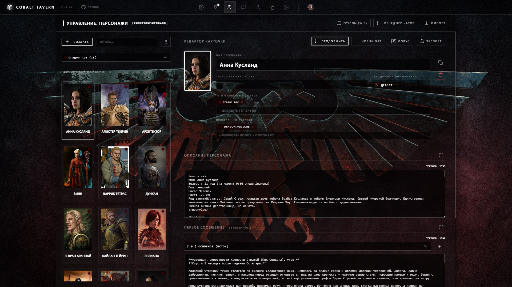
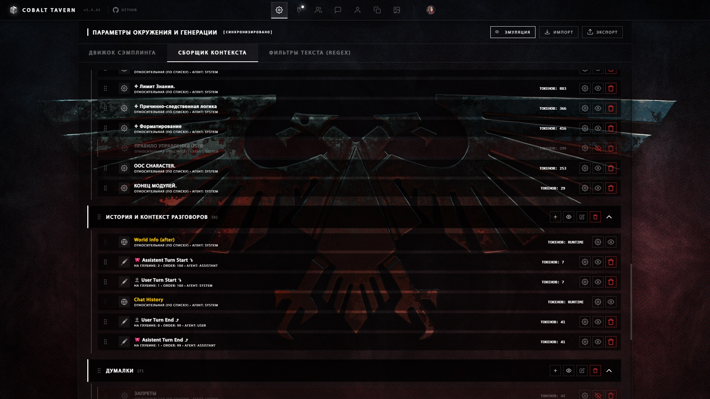

<div align="right">
  <strong>🇷🇺 Русский</strong> | <a href="./docs/README.en.md">🇬🇧 English</a>
</div>

<a name="readme-top"></a>

<div align="center">

#  Cobalt Tavern

<p align="center">
  
</p>

### Автономная рабочая станция, детерминированный инференс LLM и операционная среда для текстового ролеплея

<p align="center">
  <a href="#-ключевые-архитектурные-модули">Особенности</a> •
  <a href="#-сравнение-архитектуры">Сравнение</a> •
  <a href="#-интерактивная-матрица-эмуляции-prompt-simulator">Симулятор промпта</a> •
  <a href="#-установка-и-запуск">Установка</a> •
  <a href="#-roadmap--milestones">Roadmap</a>
</p>

<!-- БЭЙДЖИ В ФИРМЕННОЙ ПАЛИТРЕ COBALT -->
[](https://fastify.dev/)
[](https://nodejs.org/)
[](https://www.solidjs.com/)
[](#)
[](https://webassembly.org/)
[](LICENSE)

---

</div>

> [!NOTE]
> **Cobalt Tavern** — это бескомпромиссная альтернатива перегруженным веб-интерфейсам прошлого поколения. Проект спроектирован как **быстрая, строгая и детерминированная среда**: мгновенная компиляция контекста, побайтовый рентген-аудит промптов, неразрушающее сжатие историй и нулевые просадки FPS даже на диалогах в тысячи сообщений.

---

### 🌟 ROADMAP & MILESTONES

<div align="center">

| Цель | Статус | Этап разработки |
| :---: | :---: | :--- |
| **⭐ 100 Stars** | 🔓 *В процессе* | **UNLOCKED REPO.** Открытие исходного кода экосистемы (SolidJS UI + Fastify Backend) в общий доступ. |
| **⭐ 200 Stars** | 🚀 *Секретно* | Развертывание распределенной децентрализованной боевой арены и тактического хаба... |

</div>

---

## 📸 Галерея интерфейса

<p align="center">
  
  &nbsp;
  
</p>
<p align="center">
  
  &nbsp;
  
</p>
<p align="center">
  
  &nbsp;
  
</p>
<p align="center">
  
  &nbsp;
  
</p>

---

## ⚡ Сравнение архитектуры

| Возможность | Легаси веб-UI | 💠 Cobalt Tavern |
| :--- | :---: | :---: |
| **Потребление RAM в простое** | 450 – 850 MB (V8 Bloat) | **< 100 MB** (High-Efficiency Node Engine) |
| **Аудит сборщика промпта** | «Слепая» отправка / текстовый лог | **Интерактивная 3-колоночная матрица (Рентген)** |
| **Контроль окна памяти** | Текстовые счетчики токенов | **Спектральный HUD с визуализацией бюджета лора** |
| **Пересказ истории (Summary)** | Деструктивный (затирает оригинальные реплики) | **Zero Data Loss (`summary_group` без удаления чата)** |
| **Врезка на глубину (Injections)** | Ограниченная позиционка | **Мультиролевая инъекция с точным контролем `order`** |
| **Синтаксический движок** | Regex-подстановки / медленный JS | **Строгий AST/CST компилятор (Chevrotain)** |
| **Реактивный интерфейс** | Тяжелый Virtual DOM / jQuery | **Zero-Cost Reactivity (SolidJS)** |

---

## 🚀 Ключевые архитектурные модули

### 1. 📊 Анализатор распределения памяти (Context Memory HUD)
Интерактивный диагностический монитор аудита полезной нагрузки окна контекста:
* **Цветовой спектрограф категорий:** Наглядная сегментация занимаемой памяти по пяти независимым слоям:
  * 🔵 **Системные узлы:** Статический промпт пресета, директивы поведения и правила генерации.
  * 🟠 **Аватар и юзер:** Карточка персонажа (описание, сценарий, примеры диалогов) и активные модули персоны пользователя.
  * 🔴 **Реестр мира (Лорбук):** Объем активированных ключей знаний, а также индикация срезанного объема: **«Отсечено движком»** (демонстрирует, сколько тысяч токенов было безопасно заблокировано бюджетным лимитом книги).
  * 🟣 **Расширения:** Авторские заметки и динамические внедрения.
  * 🟢 **История чата:** Полезная нагрузка активных реплик диалога и учет скрытых сообщений.
* **Привязка к нативным токенизаторам:** Расчет ведется выбранным WASM-ядром (`spp:gemma.model`, `tiktoken`, `web-tokenizers`), отображая совокупную память относительно лимита модели (вплоть до 1 000 000+ токенов).

> [!TIP]
> **Сквозной вход в Симуляцию («Глазик»):** Кликните на иконку глаза прямо в виджете памяти во время активного диалога. Терминал мгновенно откроет матрицу эмуляции текущего чата, разложив контекст на атомарные узлы.

---

### 2. 🔬 Интерактивная матрица Эмуляции (Prompt Simulator)
Визуальный монитор сборки контекста, доступный как из конструктора пресетов, так и **напрямую из активного диалога**:
* **Двойная точка входа (Dual Entry):** 
  * *Из редактора пресетов:* Для калибровки шаблонов и отладки правил компоновки.
  * *Из живого чата:* Для мгновенной рентген-декомпозиции реальной текущей беседы «на молекулы» со всеми сработавшими записями лора и инъекциями.
* **Трехколоночная проекция промпта:**
  * **Roadmap (Слева):** Иерархическое дерево сборки (`[НАЧАЛО]`, `[ПЕРСОНАЖ]`, `[ОБРАЩЕНИЯ И ДЛИНА]`, системные директивы).
  * **Системный блок / Position 0 (Центр):** Развертка системных директив, сценария и маркеров окружения в строгом порядке очередности (`ORD: 100`).
  * **История чата и Depth Injections (Справа):** Наглядная визуализация того, как динамические инъекции (записи лорбука с позицией «На глуб.», авторские заметки в режиме Depth и кастомные узлы пресета с параметром инъекции) врезаются МЕЖДУ репликами диалога на заданной глубине (`DEPTH: 3`, `DEPTH: 2`, `DEPTH: 1`) со строгим соблюдением ролей (System / User / Assistant) и приоритетов сортировки (`order`).
* **Переключатель «SYNTAX-ДВИЖОК»:** Моментальное переключение между сырым кодом макросов `{{if}}...{{/if}}` и финальным скомпилированным текстом после обработки Cobalt Syntax Engine.

---

### 3. 📌 Импульсные Авторские Заметки (Author's Notes Engine)
Изолированная подсистема направляющих инструкций (`author_notes.json`):
* **Импульсный интервал срабатывания (`interval`):** Возможность активировать заметку не в каждом ходе (что вызывает бандинг и замыливание контекста модели), а строго каждые $N$ сообщений пользователя (`userMsgsCount % interval === 0`), мягко направляя сюжет.
* **Три плоскости дислокации:**
  * `before` — внедрение в начало системного блока с наивысшим приоритетом (`order: -9999`).
  * `after` — внедрение в хвост системного блока перед историей (`order: 9999`).
  * `depth` — точечная инъекция на заданную глубину истории диалога.
* **Ролевая маскировка:** Свободный выбор роли отправляемого узла (`system`, `user` или `assistant`).

---

### 4. 📝 Нарративный пересказ без потери данных (`summary_group`)

> [!IMPORTANT]
> **Нулевая потеря данных (Zero Data Loss):** В отличие от других интерфейсов, сжатие в Cobalt Tavern **никогда не удаляет реплики из файлов диалогов**. Все оригинальные сообщения, мысли, эмоциональные моменты и вложения остаются в полной сохранности на диске и отображаются в ленте чата.

* **Динамическое сжатие при инференсе:** Механика группировки помечает массив реплик идентификатором `summary_group.id`. При компиляции промпта движок `buildPrompt` на лету подменяет всю пачку сообщений группы **одной нарративной нодой пересказа** (`isSummaryNode: true`). В модель уходит лаконичная выжимка, освобождая тысячи токенов, пока вы продолжаете видеть полноценный нетронутый чат.
* **Групповой лидер (`isLast`):** Текст саммари аккумулируется в замыкающем элементе группы, сохраняя логику хронологии и кастомную роль пересказа (`user`, `assistant`, `system`).
* **Очистка от чужих мыслей:** Перед генерацией пересказа система автоматически вырезает рассуждения (`<think>`, `<thought>`, `<details>`), передавая на анализ модели исключительно факты, прямую речь и действия.

---

### 5. 🧠 Продвинутый Lore Engine (База знаний и симуляция)
* **Кластерная организация:** Группировка записей по раскрывающимся кластерам и категориям.
* **Двухуровневый семантический фильтр:**
  * **Primary Keys:** Основные ключи с поддержкой кириллических границ слов (UTF-8 regex), переключением точного совпадения (`exactMatch`) и регистра (`caseSensitive`).
  * **Secondary Logic:** Вторичный логический фильтр с 4 режимами:
    * `AND ANY` (0) — активация при нахождении любого доп. ключа.
    * `AND ALL` (3) — обязательное наличие всех доп. ключей.
    * `NOT ANY` (2) — строгое исключение: если найден хоть один доп. ключ, запись блокируется.
    * `NOT ALL` (1) — блокировка только при полном совпадении всех доп. ключей.
* **Глубокая рекурсия:** Анализ текста сработавших записей на наличие новых триггеров с контролем циклов (`delayUntilRecursion`, `preventRecursion`, `excludeRecursion`).
* **Бюджетирование и приоритеты:** Жесткое ограничение токенов на каждую книгу (`budget`), флаг `ignoreBudget` и стратегии очередности (`even`, `char_first`, `global_first`).
* **Врезка на произвольную глубину:** Узлы лора можно инжектировать не только вверх или вниз описания, но и вглубь истории с **подменой роли** (`System`, `User`, `Assistant`) и приоритетом `order`.
* **Live Lore Simulator (`/api/lorebooks/simulate`):** Тестирование условий срабатывания записей в реальном времени без обращения к внешним LLM.

---

### 6. 💬 Chat Operating System (Менеджер логов и хирургия диалогов)
Полноценная файловая подсистема для работы с массивными архивами ролевых сессий:
* **Ветвление контекста (Branching):** Мгновенное создание параллельных веток (`ВЕТВЬ_`) из любой точки диалога для проверки альтернативных развитий сюжета.
* **Хирургическая модификация на лету (`/api/chats/meta`):**
  * Смена имени персонажа или игрока **ретроактивно по всему логу** на тысячи сообщений за доли секунды.
  * Санитария данных: автоматическая нормализация токенов (`tokens` переносятся в `extra.token_count`), удаление устаревших метаданных и битых аватаров.
  * Автоматический перенос файлов между системными папками при смене привязки `character_id`.
* **Массовые операции:** Пакетное удаление логов и **массовый импорт дампов ST (.jsonl)** с автоматической раскладкой по директориям персонажей.
* **O(1) Differential Caching:** Кэширование списка и метаданных чатов в оперативной памяти с проверкой изменений по метке времени `mtime`.

---

### 7. 🎨 Тотальная кастомизация интерфейса и палитра чата

<details>
<summary><b>Развернуть список тем и палитру типографики</b></summary>
<br>

* **17 встроенных дизайнерских тем:**
  * *Cobalt Core*, *Cyberpunk 2077 (Night City)*, *Warhammer 40k (Darktide)*, *Rogue Trader*.
  * *True Grimdark*, *Dark Side (Sith)*, *Faerûn (BG3)*, *Winter is Coming (GoT)*.
  * *Blood Mage (Dragon Age)*, *Slytherin*, *Stark HUD (Marvel)*, *Kuromi Kawaii* и др.
* **Полная палитра типографики чата:** Раздельная настройка цветов для обычного текста, речи персонажа, акцентов, жирного шрифта, а также **отдельные цвета** для:
  * Мыслей и рассуждений модели (`thoughtColor` и `thoughtAltColor`).
  * Звуковых эффектов и окружения (`soundColor`).
  * Шепота и скрытых реплик (`whisperColor`).
* **Атмосфера и оптические эффекты:** Регулировка затемнения фона (`bgDim`), свечения (`bgBloom`), прозрачности панелей, многоточечных градиентов и ширины рабочей зоны (900px – 1600px или `Full Width`).
* **Менеджер кастомных шрифтов:** Загрузка собственных шрифтов (`.ttf`, `.otf`, `.woff`, `.woff2`) через UI с динамическим применением ко всей типографике.
* **Каталогизатор фонов:** Древовидные папки для артов локаций с цветовой маркировкой и Drag-&-Drop упорядочиванием.

</details>

---

### 8. ⚙️ Cobalt Syntax Engine (AST/CST Движок макросов)
Серверный процессинг абстрактных синтаксических деревьев на базе **Chevrotain**:
* **Переменная алгебра:**
  * Локальные переменные сессии: `{{.hp = 100}}`, `{{.hp--}}`, `{{.mana += 25}}`.
  * Глобальные переменные профиля: `{{$reputation = 50}}`, `{{$gold ??= 10}}`.
  * Логические проверки: `{{.status == 'alive'}}`, `{{$rank >= 5}}`.
* **Ветвления IF / ELSE:**
  ```text
  {{if .isStealth}}
      Вы бесшумно скользите в тенях...
  {{else}}
      Ваши латы предательски гремят на всю залу!
  {{/if}}
  ```
  Поддерживает инверсию (`!`), отложенные вычисления (`delayArgResolution`) и сохранение форматирования пробелов (`#`).
* **Детерминированная энтропия:**
  * `{{pick::Кинжал::Меч::Топор}}` — детерминированный выбор на базе MD5-хэша позиции ноды и контента чата.
  * `{{roll::2d6+3}}` — броски кубиков DnD через библиотеку `droll`.
  * `{{random::Вариант 1::Вариант 2}}` — чистый энтропийный рандомайзер.

---

### 9. 🌐 Унифицированный шлюз инференса (LLM Gateway)
* **Поддерживаемые API:** OpenAI, OpenRouter, Groq, Anthropic Claude, Google Gemini / Vertex.
* **Next-Gen Google Interactions API:**
  * Нативная поддержка рассуждающих агентов (`deep-research`, `antigravity`, `gemini-3`).
  * Настройка бюджета мышления (`thinking_budget` / `thinking_level`).
  * Перехват и раздельный стриминг блоков мыслей модели (`step.start`, `step.delta`, теги `<think>`).
* **Отказоустойчивость и Abort Pipeline:** Мгновенный разрыв исходящего HTTP/SSE соединения через `AbortController` при остановке генерации пользователем.
* **Кольцевой инспектор запросов:** Хранение в оперативной памяти последних 15 детальных логов (raw request, raw response, длительность, HTTP-статусы).
* **Модели постобработки контекста:** Режимы `none`, `semi_strict` и `strict` (автоматическая конвертация ролей, слияние дублирующихся реплик подряд, вставка заглушек `user: ...`).

---

### 10. 🧮 Нативная WASM-токенизация
* **SentencePiece WASM:** Локальная поддержка бинарных моделей токенизаторов `.model` (Llama, Mistral, Gemma).
* **Web-Tokenizers & Tiktoken:** Поддержка BPE-токенизаторов Claude и GPT.
* **OOM-Protection:** Безопасный чанкинг входного текста блоками по 25 000 знаков, исключающий сбои памяти V8.

---

### 11. 👤 Модульная система Персон и Персонажей
* **Модульные персоны:** Профиль игрока формируется из независимых переключаемых модулей (внешность, инвентарь, биография, пассивные баффы), сгруппированных по категориям.
* **Децентрализованное хранилище:** Каждый персонаж и персона изолированы в собственных `.json` файлах в `data/default-user/`.
* **Потоковый менеджер медиа:** Загрузка аватаров и фонов через Node.js streams с лимитом Fastify в 250 MB.

---

## 💻 Системные требования

* **ОС:** Windows 10/11, Linux (Ubuntu, Debian, Arch), macOS (Intel / Apple Silicon).
* **Среда выполнения:** Node.js v18.0.0 или выше.
* **Потребление ресурсов:** Серверное ядро потребляет менее 100 МБ RAM. Нагрузка зависит исключительно от выбранного бэкенда инференса (KoboldCpp, LM Studio, vLLM, Ollama или Cloud API).

---

## 🛠 Установка и запуск

### Автоматический запуск (Windows)
```bash
# 1. Склонируйте репозиторий
git clone https://github.com/GrishaDeLumiere/Cobalt-Tavern.git

# 2. Запустите скрипт инициализации
start.bat
```
*Скрипт развернет окружение, проверит зависимости, выполнит холодную инициализацию файловой системы и откроет терминал в браузере.*

### Ручной запуск (Linux / macOS / Dev)
```bash
# 1. Перейдите в папку сервера и установите зависимости
cd core
npm install

# 2. Запустите сервер
npm start

# Или в режиме разработки с Live Reload:
npm run dev
```

---

## ⚙️ Конфигурация сервера (`core/config.json`)

<details>
<summary><b>Развернуть параметры config.json</b></summary>
<br>

При первом старте система автоматически генерирует `config.json`:

```json
{
    "port": 8000,
    "host": "0.0.0.0",
    "autoOpenBrowser": true
}
```

| Параметр | По умолчанию | Назначение |
| :--- | :---: | :--- |
| `port` | `8000` | Порт Fastify REST API и раздачи UI. Переменная окружения `PORT` имеет высший приоритет. |
| `host` | `0.0.0.0` | Сетевой интерфейс (`0.0.0.0` — доступ из локальной сети, `127.0.0.1` — строго локальный). |
| `autoOpenBrowser` | `true` | Автоматически открывать браузер при успешной инициализации сервера. |

</details>

---

## 🔄 Система обновления ядра

В сервер встроен потоковый модуль синхронизации релизов (`/api/updater`):
* Автоматическая проверка свежих версий ядра через сопоставление версий в `package.json`.
* Потоковая трансляция логов процесса обновления через Server-Sent Events (`/api/updater/update-stream`).
* Пофайловая синхронизация с валидацией контрольных сумм по алгоритму **SHA-256** (`getFileHash`).
* **Изоляция пользовательских данных:** Папки и файлы пользователя (`data/`, `.env`, `node_modules`, `.git`) защищены списком исключений (`IGNORE_LIST`) и никогда не перезаписываются при обновлении.
* Автоматическая зачистка временных архивов в `temp_update/` по завершении процедуры.

---

## 📈 Динамика проекта

<div align="center">

[](https://star-history.com/#GrishaDeLumiere/Cobalt-Tavern&Date)

</div>

---

## 📜 Лицензия (Proprietary: Personal Use Only)

Проект распространяется под проприетарной лицензией **Copyright (c) 2026 GrishaDeLumiere**.

* Разрешено исключительно персональное некоммерческое использование.
* Запрещено создание форков с целью публичного распространения или ребрендинга.
* Запрещено извлечение компонентов архитектуры для коммерциализации в сторонних сервисах.

Подробные положения изложены в файле [LICENSE](LICENSE).

---

<div align="center">
  <sub>Архитектурный дизайн и разработка: <b>GrishaDeLumiere</b></sub>
</div>